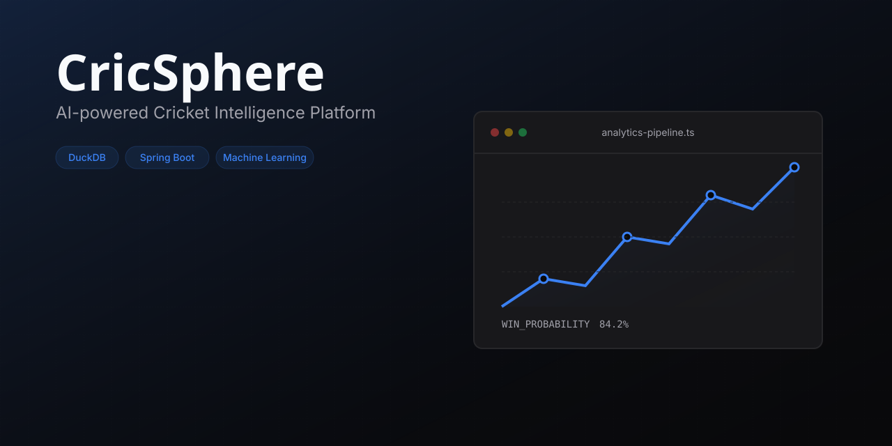
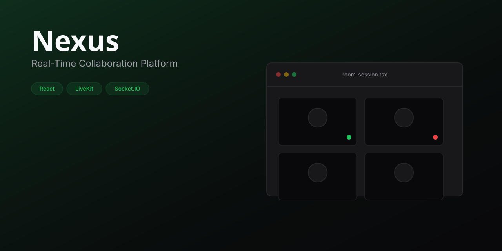
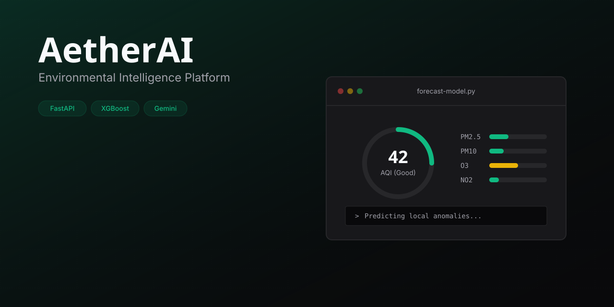

# Developer Workspace
*Building intelligent software from data to deployment.*

---

## Workspace Status

```text
Status        ONLINE
Location      Hyderabad, India
Current Build Nexus
Focus         Full Stack Engineering, Machine Learning, Backend Systems
Looking For   Software Engineering Internship 2027
```

---

## Featured Builds

### CricSphere

<p><strong>AI-powered Cricket Intelligence Platform</strong></p>
<p>Built a full-stack cricket platform with live match data integration and AI-ML powered analytics. Engineered the backend using Node.js/Express, integrated RapidAPI with robust caching, and developed a smooth React frontend.</p>

* **DuckDB** • **Spring Boot** • **Machine Learning**

[ Repository](https://github.com/Vaibhav-1819/CricSphere-Version1) &nbsp; [ Live Demo](https://cricsphere-version1.vercel.app/)

---

### Nexus

<p><strong>Real-Time Collaboration Platform</strong></p>
<p>Migrated a WebRTC mesh architecture toward a Selective Forwarding Unit (SFU) model. Integrated Firebase for auth, LiveKit for video routing, and Socket.IO for real-time state management.</p>

* **React** • **LiveKit** • **Socket.IO** • **Firebase**

[ Repository](https://github.com/Vaibhav-1819/Nexus-Version1)

---

### AetherAI

<p><strong>Environmental Intelligence Platform</strong></p>
<p>Engineered a full-stack system serving an XGBoost machine learning model for real-time air quality forecasting. Integrated Gemini API for natural language environmental insights.</p>

* **FastAPI** • **XGBoost** • **Gemini** • **React**

[ Repository](https://github.com/Vaibhav-1819)

---

## Workspace Modules

```text
workspace@vaibhav:~$ ls -l modules/

[✔] CricSphere
[✔] Nexus
[✔] AetherAI
[✔] Developer Workspace

Next Module: Software Engineering Internship
```

---

## Engineering Stack

**Frontend**<br/>
React • HTML5 • CSS3 • Tailwind CSS

**Backend**<br/>
Node.js • Express.js • REST APIs • FastAPI

**Machine Learning**<br/>
Deep Learning • CNNs • Transfer Learning • TensorFlow • XGBoost

**Databases**<br/>
MySQL • Oracle SQL • Firebase • NoSQL • SQLite

**Cloud & Tools**<br/>
Git • OCI • AWS (Basics) • Docker (Basics)

---

## Engineering Highlights

| Metric | Context |
|--------|---------|
| **22,000+** | Matches Analyzed (CricSphere) |
| **638K+** | Player Matchups Processed |
| **11,000+** | Training Images (BrandRecognizer) |
| **80%** | Model Accuracy (Transfer Learning) |

---

## GitHub Stats

<div align="center">
  
  
</div>

---

## Current Learning

- System Design
- Distributed Systems
- Machine Learning Engineering
- Cloud Infrastructure
- Data Structures & Algorithms

---

## Engineering Philosophy

I believe in building complete software systems rather than isolated components. From architecting scalable backend APIs and deploying machine learning models to crafting intuitive user interfaces, my focus is always on engineering cohesive, performant, and reliable products that solve real-world problems.

---

## Connect

[Portfolio](https://vaibhav-portfolio-v2.vercel.app/) • [LinkedIn](https://linkedin.com/in/vaibhav-bharathula) • [Email](mailto:bharathulavaibhav@gmail.com) • [GitHub](https://github.com/Vaibhav-1819)

---

```text
workspace@vaibhav:~$ exit

Developer Workspace v3
Status: ONLINE
Designed & Engineered by Bharathula Venkata Vaibhav Ram
```
