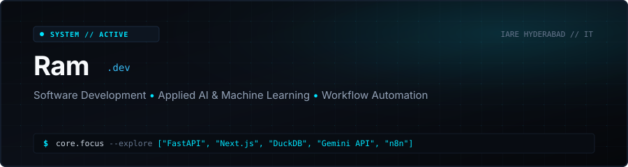

<p align="center">
  
</p>

<p align="center">
  <a href="https://vaibhavbharathula.tech/"></a>
  &nbsp;
  <a href="https://linkedin.com/in/vaibhav-bharathula"></a>
  &nbsp;
  <a href="mailto:bharathulavaibhav@gmail.com"></a>
  &nbsp;
  <a href="https://github.com/Vaibhav-1819"></a>
</p>

```text
Identity: Vaibhav Bharathula  •  IT Undergrad @ IARE Hyderabad  •  Focus: Systems, Applied AI & Automation
```

---

### 01 // About & Focus

I am an Information Technology undergraduate at the **Institute of Aeronautical Engineering (IARE), Hyderabad**. My work centers on building practical software systems: performant backend services, applied machine learning integrations that solve real domain problems, and automated workflow pipelines that eliminate operational friction.

Rather than treating technologies as isolated checkboxes, I focus on understanding data flow from ingestion to inference, handling latency trade-offs, and shipping software with clean architecture and solid user interfaces.

* **Engineering Mindset:** Prioritizing working software, deterministic state, and measurable performance over hype.
* **Core Domains:** Full-stack web applications, in-process analytical databases, applied AI toolchains, and event automation.
* **Objective:** Continuously expanding technical rigor through ambitious personal builds and preparing for software engineering roles.

---

### 02 // Technical Toolbox

A curated breakdown of tools and frameworks I work with, categorized by architectural layer.

<p align="center">
  <a href="https://skillicons.dev">
    
  </a>
</p>

#### Core Technologies Explored

* **Programming Languages:** Python, Java, JavaScript (ES6+)
* **Frontend Engineering:** React, Next.js, HTML5, CSS3, Modern UI Tooling
* **Backend & APIs:** FastAPI, Node.js, Express.js, RESTful Architecture
* **Databases & Analytical Storage:** SQLite, DuckDB (In-Memory OLAP), PostgreSQL / MySQL fundamentals
* **Applied AI & Automation:** Gemini API integration, n8n workflow orchestration, Webhooks & Pipeline Automation

#### Currently Deepening & Learning

* Advanced distributed systems design & event streaming patterns
* Low-latency API caching and in-process OLAP vectorization
* LLM agentic tool use and evaluation pipelines

---

### 03 // Featured Builds

Key projects that demonstrate end-to-end architecture, real problem-solving, and practical technology application.

#### 🏏 [CricSphere — Cricket Intelligence & Analytics Engine](https://cricsphere-version3.vercel.app/)
> **AI-Powered Match Analytics & Historical Query Engine**
> 
> * **The Challenge:** Ingesting and querying extensive ball-by-ball match histories without incurring sluggish relational database query latencies on large aggregations.
> * **The Architecture:** Integrated **DuckDB** as an embedded analytical query layer for millisecond analytical aggregations across hundreds of thousands of player matchup data points. Built the backend using **Node.js/Express** with an API caching layer over external cricket feeds.
> * **Frontend:** Developed a reactive **React** interface with interactive simulation analytics and match telemetry.
> 
> `DuckDB` • `Node.js` • `Express` • `React` • `RapidAPI Caching` • `Machine Learning`  
> [Visit Application →](https://cricsphere-version3.vercel.app/)

---

#### 🌐 Nexus — Real-Time Collaboration & Video Suite
> **Low-Latency Multi-Party Video & State Synchronization**
> 
> * **The Challenge:** Traditional peer-to-peer WebRTC mesh calls suffer exponential upload bandwidth and CPU degradation as participant counts grow.
> * **The Architecture:** Re-architected media distribution from a P2P mesh toward a **Selective Forwarding Unit (SFU)** model via **LiveKit**, drastically minimizing client egress bandwidth.
> * **State Management:** Orchestrated low-latency bi-directional state updates and presence using **Socket.IO**, with **Firebase Auth** managing secure sessions.
> 
> `React` • `LiveKit SFU` • `Socket.IO` • `WebRTC` • `Firebase Auth`  
> 🚧 *Currently being developed*

---

#### 🍃 [AetherAI — Environmental Forecasting Engine](https://github.com/Vaibhav-1819/AetherAI)
> **Predictive Machine Learning Regression & Natural Language Climate Insights**
> 
> * **The Challenge:** Raw numerical air quality metrics are difficult for general users to contextualize into proactive health choices.
> * **The Architecture:** Trained an **XGBoost** regression model served via a high-throughput **FastAPI** backend delivering sub-100ms inference times.
> * **AI Synthesis:** Pipelined model outputs into the **Gemini API** to automatically generate actionable, natural-language health advisories and environmental summaries.
> 
> `FastAPI` • `Python` • `XGBoost` • `Gemini API` • `React`  
> [View Codebase →](https://github.com/Vaibhav-1819/AetherAI)

---

### 04 // Current Exploration & Engineering Journey

Rather than chasing superficial trends, I maintain an active log of technical areas I am currently experimenting with:

* **In-Memory Analytical Querying:** Exploring internal columnar storage mechanics, vectorized query execution, and DuckDB analytical pipelines for data-intensive web apps.
* **Workflow Automation & Agentic Pipelines:** Constructing multi-step automation sequences using **n8n** and custom Python micro-services to automate task flows and bridge LLM APIs with real-world databases.
* **Modern Next.js & Server Components:** Implementing streaming architectures, server actions, and edge rendering for high-performance developer tooling.

---

### 05 // Activity & Telemetry

<p align="center">
  <a href="https://github.com/Vaibhav-1819">
    
  </a>
  &nbsp;
  <a href="https://github.com/Vaibhav-1819">
    
  </a>
</p>

---

### 06 // Transmission & Connect

If you'd like to discuss system architectures, collaborate on ambitious software projects, or explore technology opportunities:

<p align="center">
  <a href="https://vaibhavbharathula.tech/">
    
  </a>
  &nbsp;
  <a href="https://linkedin.com/in/vaibhav-bharathula">
    
  </a>
  &nbsp;
  <a href="mailto:bharathulavaibhav@gmail.com">
    
  </a>
  &nbsp;
  <a href="https://github.com/Vaibhav-1819">
    
  </a>
</p>

<p align="center">
  <sub>Engineered by <b>Ram</b> • Built for clarity, performance, and substance.</sub>
</p>
